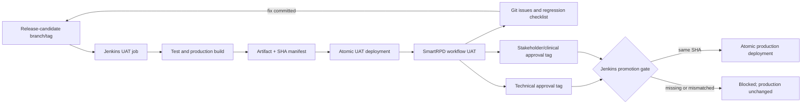

# Design Document

## Overview

This design adds a practical UAT release path to the existing SmartRPD Jenkins and nginx deployment. A configured release-candidate branch or tag triggers Jenkins for one exact Git commit. Jenkins runs the existing non-interactive tests and production build, packages the static site, and deploys it to a separate UAT nginx location. Reviewers exercise the 2D Annotation, 3D preview, API, and case workflows, while feedback and defects are tracked in Git issues against that commit.

Corrections are committed as new revisions and follow the same build, UAT deployment, and regression path. Production remains unchanged until both technical and stakeholder/clinical approvals exist for the exact revision. Deployment uses versioned directories and atomic symlink changes so a failure leaves the previously served UAT or production release available. No Google Cloud services or new application backend are introduced.

## Goals and Non-Goals

### Goals
- Track every run, artifact, issue, test result, approval, and deployment by full Git commit SHA.
- Keep UAT and production on distinct nginx addresses and filesystem roots.
- Test the real SmartRPD release workflows before production.
- Use Git issues for UAT feedback, defects, correction links, and regression evidence.
- Require separate technical and stakeholder/clinical approval for the same revision.
- Preserve the active release whenever verification or deployment fails.

### Non-Goals
- Replacing Jenkins, nginx, Jest, Webpack, or the current static-site architecture.
- Adding an approval service, feedback API, database, or other application backend.
- Introducing cloud-specific deployment infrastructure or broad release-management abstractions.

## Architecture



The implementation has two Jenkins entry points: a Git-triggered UAT pipeline and a protected, manually requested production-promotion stage or job. Both operate on immutable artifacts keyed by the full commit SHA.
## Components and Interfaces

### 1. Git trigger and revision capture
Jenkins accepts only the configured release-candidate branch or tag. At pipeline start it resolves `GIT_COMMIT` to a full SHA and stores it in the build description and `release-manifest.json`. A small Jenkins-side trigger claim uses an atomic marker keyed by repository, ref, SHA, and webhook delivery ID; a duplicate delivery reuses the recorded run rather than starting another.

```text
claimTrigger(repository, ref, revision, deliveryId) -> {claimed, pipelineRunId}
```

### 2. Verification and packaging
The pipeline checks out the captured SHA, runs `npm ci`, `npm run test:ci -- --runInBand`, and then `npm run build`. Build is not attempted after a failed test, and UAT deployment requires explicit passing test and build results. Jenkins archives logs, test reports, the static-site archive, and a manifest containing the SHA, build number, timestamp, file list, and archive digest. Promotion uses this archive; it does not rebuild another revision.

```text
verifyAndPackage(revision) -> {testResult, buildResult, artifactPath, digest, manifest}
```

### 3. nginx UAT and production locations
Use separate nginx server names (or separate ports if DNS is unavailable) and roots:

```text
/var/www/smartrpd-uat/releases/<full-sha>/
/var/www/smartrpd-uat/current -> releases/<full-sha>/
/var/www/smartrpd-prod/releases/<full-sha>/
/var/www/smartrpd-prod/current -> releases/<full-sha>/
```

For example, `uat.smartrpd.example` serves only the UAT `current` link and `smartrpd.example` serves only production. Jenkins uses separate deploy commands/credentials for each root. It extracts into a new release directory, verifies the manifest and required files, smoke-checks the staged content, then atomically changes that environment's `current` link. It never clears an active directory in place.

```text
deploy(environment, artifact, revision, digest) -> {status, address, previousRevision, deployedRevision}
```

### 4. UAT workflow checklist and Git feedback
A versioned Markdown checklist in the repository defines expected results for:
- case login, listing, creation/opening, update, and other agreed case workflows;
- the 2D Annotation experience in `src/pages/2DAnnotation.html`, including image loading, annotation tools, undo/redo, save/history, and relevant upload actions;
- 3D preview/viewer loading, controls, model display, and related file actions;
- API-dependent behavior, error handling, and expected responses using approved UAT/test credentials and data; and
- a short cross-browser and responsive smoke pass where required by the supplied UAT instructions.

The successful Jenkins run publishes the UAT URL, full SHA, manifest digest, and checklist link. A Git issue template requires the tested SHA, Jenkins run, scenario ID, expected result, actual result, severity, and evidence. Defects and interruptions are therefore searchable Git issues rather than records in a new SmartRPD backend.

```text
recordScenario(issueOrChecklist, revision, scenarioId, result, evidence)
recordDefect(issue, evaluatedRevision, affectedTests, affectedScenarios)
```

### 5. Correction and regression path
A defect fix is a normal commit/PR linked to its Git issue. The resulting new SHA triggers a new UAT run. The issue records affected automated tests and UAT scenarios. Jenkins reruns the complete configured automated suite; reviewers rerun at least the affected 2D Annotation, 3D, API, or case scenarios and attach outcomes to the issue. A failed or incomplete regression keeps the issue open and the revision ineligible for promotion. Approvals for the earlier SHA remain historical only.

### 6. Dual approval and production promotion
After all required scenarios and regressions pass, authorized approvers create two protected annotated Git tags that point directly to the candidate commit:

```text
uat-approved/technical/<full-sha>
uat-approved/stakeholder-clinical/<full-sha>
```

Each annotation records approval type, `decision=APPROVED`, approver identity, date/time, Jenkins run URL, and UAT evidence link. Protected tag rules restrict creation to the appropriate roles and prohibit update/deletion. These separate annotated tags are the immutable sign-off records; Git history and the Jenkins evidence archive retain them after the run.

The protected promotion action accepts a full SHA. Jenkins verifies that both annotated tags exist, resolve to that exact SHA, contain the required metadata, and correspond to a successful UAT artifact and completed regression evidence. Any missing, rejected, malformed, or mismatched record blocks promotion without touching production.

```text
evaluatePromotion(revision, manifest, technicalTag, stakeholderTag, regressionEvidence)
  -> {eligible, reasons}
promote(revision, digest) -> {status, previousRevision, deployedRevision}
```

## Data Models

| Record | Minimum content |
|---|---|
| `release-manifest.json` | Full revision, repository/ref, Jenkins run ID, test/build results, artifact digest, file list, UAT address, timestamps. |
| Git UAT issue | Evaluated revision, run URL, scenario, expected/actual result, severity, evidence, affected tests/scenarios, correction SHA, regression status. |
| Approval tag | Target revision, approval type, decision, approver identity, recorded date/time, evidence link. |
| Deployment record | Environment, requested revision/digest, previous revision, outcome, address, timestamp, error if any. |

The full SHA is the join key. Records for revision `R1` never imply results or approval for `R2`.

## Deployment Flow

1. Git pushes a configured release-candidate ref; Jenkins atomically claims the trigger and captures the full SHA.
2. Jenkins checks out that SHA, runs tests, and performs the production build only after tests pass.
3. Jenkins creates and archives one static artifact and revision manifest.
4. Jenkins stages the artifact under the UAT releases directory and atomically switches only the UAT link after validation.
5. Reviewers execute the SmartRPD checklist and record results, feedback, interruptions, and defects in revision-specific Git issues.
6. Fixes create a new SHA and repeat steps 1–5, including affected regression scenarios.
7. Authorized technical and stakeholder/clinical approvers independently create protected annotated approval tags for the accepted SHA.
8. Jenkins verifies both tags and promotes the archived artifact for that SHA to a new production release directory.
9. Jenkins atomically switches production, smoke-tests it, and records the result. On a failed post-switch smoke test it restores the previous production link.

## Error Handling

| Failure | Safe behavior |
|---|---|
| Duplicate Git delivery | Return the existing run claim; do not start a second pipeline run. |
| Checkout SHA mismatch | Fail before tests and record expected and actual SHAs. |
| Failed, missing, aborted, or unclear test/build result | Fail closed; do not deploy; leave both active links unchanged. |
| Artifact or manifest digest mismatch | Reject staging or promotion and retain active UAT/production content. |
| UAT copy, validation, or smoke failure | Remove only incomplete staging; leave UAT and production links unchanged. |
| UAT interruption | Record it in the Git issue/run evidence; do not record affected scenarios as passed. |
| Missing regression result | Keep the corrected revision ineligible for promotion. |
| Missing or mismatched approval tag | Record a blocked promotion and leave production unchanged. |
| Production pre-switch failure | Leave the production link unchanged. |
| Production post-switch smoke failure | Atomically restore the captured prior link and record failed promotion. |
| Jenkins status-write failure | Append the error to the build log/evidence and retain the preceding recorded status. |

## Requirements Traceability

| Requirements | Design coverage |
|---|---|
| 1.1–1.10 | Git trigger claim, full-SHA manifest, separate nginx roots/addresses, atomic UAT deployment, deployment records, failure handling. |
| 2.1–2.9 | Ordered test/build stages, explicit pass gates, Jenkins results, fail-closed behavior, status-write handling. |
| 3.1–3.7 | Published UAT URL/SHA/instructions, workflow checklist, revision-specific Git issues, scenario evidence, interruption handling. |
| 4.1–4.9 | Git-linked defects/corrections, new revision/run, affected test/scenario fields, complete automated rerun and targeted UAT regression. |
| 5.1–5.6 | Separate protected annotated approval tags with required metadata, retention, evidence retrieval, revision scoping. |
| 6.1–6.6 | Exact-SHA dual-tag gate, protected promotion, archived-artifact deployment, atomic production switch and rollback. |
## Correctness Properties

*A correctness property describes behavior that must hold across all valid inputs. These properties cover the small, deterministic policy helpers around the Jenkins workflow; nginx, Git hosting, and filesystem behavior are tested with focused integration and smoke tests instead.*

### Property 1: Trigger claiming is idempotent
For all valid trigger keys, claiming the same key any number of times creates exactly one pipeline-run identity, while each distinct key may create a different identity.

**Validates: Requirements 1.1**

### Property 2: Verification is fail-closed and revision-consistent
For all requested revisions and combinations of test/build records, UAT deployment is permitted only when the test and build results are explicitly passing and every result identifies the exact requested revision; every failed test or build produces a failed classification.

**Validates: Requirements 1.2, 2.5, 2.6**

### Property 3: UAT evidence preserves its evaluated revision
For all valid feedback and scenario-result records, accepting and retrieving the record preserves the exact full revision, and scenario evidence also preserves its scenario identifier and result.

**Validates: Requirements 3.4, 3.5**

### Property 4: Defect corrections cannot reuse the observed revision
For all valid defect records and proposed correction revisions, the defect remains associated with its exact evaluated revision and a correction is accepted only when its full SHA differs from the evaluated SHA.

**Validates: Requirements 4.1, 4.2**

### Property 5: Regression completion requires complete linked results
For all corrected revisions, defects, affected-test sets, affected-scenario sets, and regression results, regression is complete only when every affected test and scenario has a passing result for that corrected revision; every failed result retains both the defect identifier and corrected revision.

**Validates: Requirements 4.6, 4.7, 4.8, 4.9**

### Property 6: Production eligibility requires two valid approvals for one exact revision
For all requested revisions and collections of sign-off records, production eligibility is true only when there is one schema-valid technical approval and one separate schema-valid stakeholder/clinical approval, both approved and targeting the exact requested revision; approvals for any other revision do not contribute to eligibility.

**Validates: Requirements 5.3, 5.6, 6.1, 6.2, 6.5**

## Testing Strategy

Use a dual approach: unit/property tests for deterministic validation and gating helpers, plus a small number of Jenkins/nginx integration tests for actual deployment behavior. Property tests run at least 100 generated cases each and carry tags in the form `Feature: git-based-uat-deployment, Property N: <property title>`.

### Automated unit and property tests
- Test trigger-key generation/claim behavior, full-SHA validation, manifest/check classification, feedback and regression record validation, approval-tag parsing, and promotion eligibility.
- Include fixed edge cases for missing results, aborted/unstable results, malformed or shortened SHAs, duplicate approval types, absent annotation fields, empty affected sets, failed regressions, and status-write errors.
- Keep generated tests in memory or use temporary directories; do not repeatedly call live Git hosting, Jenkins, nginx, or APIs from property tests.

### Jenkins and deployment integration tests
Run representative non-production pipeline exercises:
1. Passing tests/build deploy a known SHA to UAT and archive its URL, manifest, digest, and successful status.
2. Failing tests prevent build/deployment; failing build prevents deployment.
3. UAT staging or smoke failure leaves both UAT and production symlinks unchanged.
4. nginx serves UAT and production from distinct addresses and roots.
5. A corrected commit creates a new run, reruns the automated suite, and requires affected UAT regression scenarios.
6. Missing or mismatched approval tags block production without changing it.
7. Two valid protected tags for one SHA permit promotion of that SHA's archived artifact.
8. Production pre-switch failure leaves the old link active; post-switch smoke failure restores it.
9. Jenkins evidence remains retrievable by SHA after the run, including test/build results and sign-off tags.

### Manual SmartRPD UAT
For each candidate, execute the versioned checklist against the published SHA and record results in Git:
- 2D Annotation: open the experience shown in the supplied slide, load the case image, use the agreed annotation tools, verify undo/redo, save, reopen/history, and relevant upload behavior.
- 3D preview: load representative models, inspect rendering and controls, and verify expected model/file actions.
- APIs: exercise representative success, validation, authorization/session, and unavailable/error responses using approved UAT/test data.
- Case workflows: verify the agreed login, case list, create/open/update, navigation, and related operational paths.
- Defect fixes: rerun every affected scenario plus a concise smoke pass of the connected workflows.

Technical approval confirms automated checks, deployment evidence, API behavior, and regression results. Stakeholder/clinical approval confirms the workflow outcomes are acceptable. Both approvals must be recorded separately for the same full SHA before the production action is enabled.