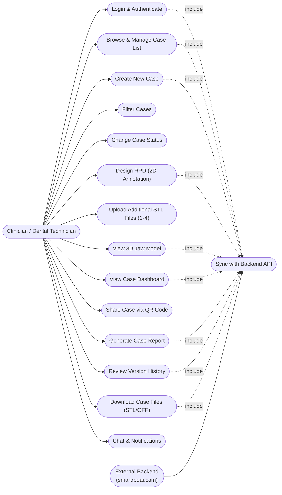

# SmartRPD Overview — Mermaid Diagrams

Companion to `SmartRPD_Overview.mdj` (StarUML project file). Paste either block into
[mermaid.live](https://mermaid.live) or any Mermaid-aware markdown viewer (GitHub, VS Code, etc.)
to render immediately.

## Business capability map

## Technical structure

```mermaid
flowchart TB
    subgraph PRES["Presentation Layer (static SPA, nginx / Docker)"]
        Login["Login<br/><small>login.js, authGuard.js</small>"]
        CaseList["Case List<br/><small>caseManagement.js</small>"]
        CaseCreate["Case Creation<br/><small>createCase.js</small>"]

        subgraph TWOD["2D Annotation"]
            Engine["2D Design Engine<br/><small>components*.js, annotation*.js</small>"]
            ExtraStl["Extra STL Preview<br/><small>preview3D.js</small>"]
            Clinical["Clinical Info<br/><small>clinicalInfo.js, caseNote.js</small>"]
            Notice["Noticeboard / Report Builder<br/><small>noticeboard.js</small>"]
            JawStruct["JawStruct Codec<br/><small>jawStructApi/Apply/Codec/Codes.js</small>"]
            InstrEdit["Instruction Editor<br/><small>instructionEditor.js</small>"]
        end

        Viewer3D["3D Viewer<br/><small>index.js, newControls.js</small>"]
        Dashboard["Dashboard<br/><small>dashboard.js</small>"]
        VerHist["Version History<br/><small>versionHistory.js</small>"]
        Shell["Shared Shell<br/><small>appSidebar, chat, notifications, accessibility, ThreeDMobile</small>"]
        ApiClient["API Client<br/><small>ApiClient.js</small>"]
        Crypt["Crypt (ID obfuscation)<br/><small>crypt.js</small>"]
    end

    subgraph PROTO["Prototype (unreleased)"]
        SortApp["Sort Case List (React)<br/><small>MUI / Radix, login screen only</small>"]
    end

    Backend[["External Backend API<br/>smartrpdai.com"]]
    QRLib[["qrcodejs (CDN)<br/>not yet in this branch"]]

    Login --> Backend
    CaseList --> Backend
    CaseCreate --> Backend
    JawStruct --> Backend
    Clinical --> Backend
    Viewer3D --> Backend
    Dashboard --> Backend
    VerHist --> Backend
    Shell --> Backend
    Notice --> Backend
    CaseList -.-> QRLib
    Viewer3D --> ApiClient --> Backend
    Viewer3D --> Crypt
    CaseList --> Crypt

    style Backend fill:#3a3d3a,stroke:#8f8a78,color:#fff
    style QRLib fill:#3a3d3a,stroke:#8f8a78,color:#fff
    style SortApp fill:#5b5f59,stroke:#8f8a78,color:#fff
```

